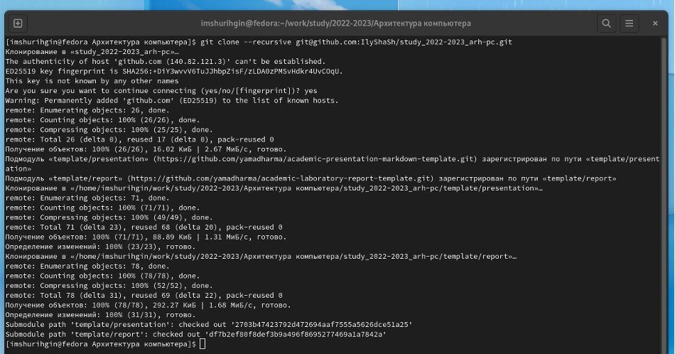
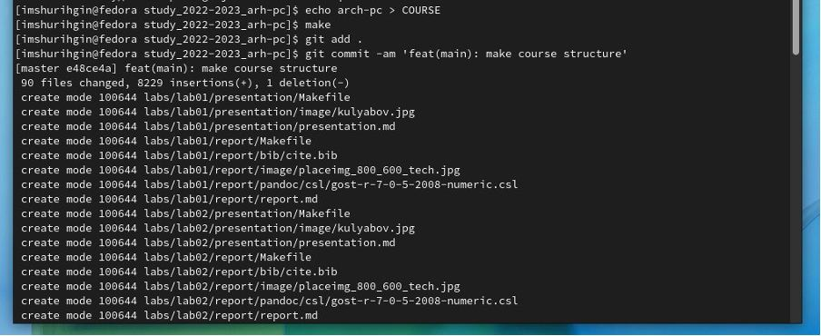
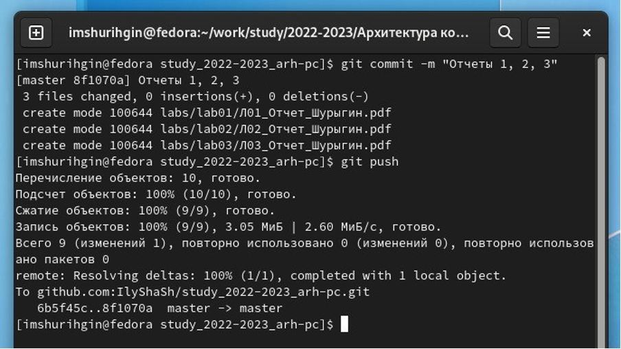

---
## Front matter
title: "ОТЧЕТ 
ПО ЛАБОРАТОРНОЙ РАБОТЕ №3"
subtitle: "дисциплина: Архитектура компьютера"
author: "Шурыгин Илья Максимович"

## Generic otions
lang: ru-RU
toc-title: "Содержание"

## Bibliography
bibliography: bib/cite.bib
csl: pandoc/csl/gost-r-7-0-5-2008-numeric.csl

## Pdf output format
toc: true # Table of contents
toc-depth: 2
lof: true # List of figures
lot: true # List of tables
fontsize: 12pt
linestretch: 1.5
papersize: a4
documentclass: scrreprt
## I18n polyglossia
polyglossia-lang:
  name: russian
  options:
	- spelling=modern
	- babelshorthands=true
polyglossia-otherlangs:
  name: english
## I18n babel
babel-lang: russian
babel-otherlangs: english
## Fonts
mainfont: PT Serif
romanfont: PT Serif
sansfont: PT Sans
monofont: PT Mono
mainfontoptions: Ligatures=TeX
romanfontoptions: Ligatures=TeX
sansfontoptions: Ligatures=TeX,Scale=MatchLowercase
monofontoptions: Scale=MatchLowercase,Scale=0.9
## Biblatex
biblatex: true
biblio-style: "gost-numeric"
biblatexoptions:
  - parentracker=true
  - backend=biber
  - hyperref=auto
  - language=auto
  - autolang=other*
  - citestyle=gost-numeric
## Pandoc-crossref LaTeX customization
figureTitle: "Рис."
tableTitle: "Таблица"
listingTitle: "Листинг"
lofTitle: "Список иллюстраций"
lotTitle: "Список таблиц"
lolTitle: "Листинги"
## Misc options
indent: true
header-includes:
  - \usepackage{indentfirst}
  - \usepackage{float} # keep figures where there are in the text
  - \floatplacement{figure}{H} # keep figures where there are in the text
---

# Цель работы

Научиться работать с системой git и с сайтом github.

# Задание

Необходимо разобраться, как настроить git, создать репозиторий и каталог курса, загрузить отчеты лабораторных работ. 

# Выполнение лабораторной работы

1. Создадим профиль на Github и настроим его (у меня он уже был создан). (рис. [-@fig:001])

{ #fig:001 width=70% }

2.	Настроим git в терминале.(рис. [-@fig:002])

{ #fig:002 width=70% }

3.	Создадим SSH ключ (он начинается с SHA256).(рис. [-@fig:003])

{ #fig:003 width=70% }

4.	Загружаем сгенерённый открытый ключ на сайт Github.(рис. [-@fig:004])

{ #fig:004 width=70% }

5.	Создаем каталог для предмета и репозиторий курса через web-интерфейс gitgub.(рис. [-@fig:005])(рис. [-@fig:006])

{ #fig:005 width=70% }

{ #fig:006 width=70% }

6.	Клонируем и настраиваем созданный репозиторий.(рис. [-@fig:007])

{ #fig:007 width=70% }

7.	Настраиваем каталог курса.(рис. [-@fig:008])

{ #fig:008 width=70% }

{ #fig:008 width=70% }

{ #fig:008 width=70% }

# Задание для самостоятельной работы:

1.	Добавим отчет по 3-ей лабораторной работе в каталог рабочего пространства.

2.	Скопируем прошлые работы в соответствующие каталоги. Используем команды: git add -A, чтобы добавить все изменения и git status, чтобы проверить изменения.(рис. [-@fig:010])

{ #fig:010 width=70% }

3.	Загрузим файлы на github при помощи команд: git commit – m, чтобы сохранить все добавленные изменения и git push, чтобы отправить изменения в центральный репозиторий.(рис. [-@fig:011])

{ #fig:011 width=70% }

# Выводы

В данной лабораторной работе я научился работать с системой git и каталогами. Теперь все отчеты хранятся на моем аккаунте github.